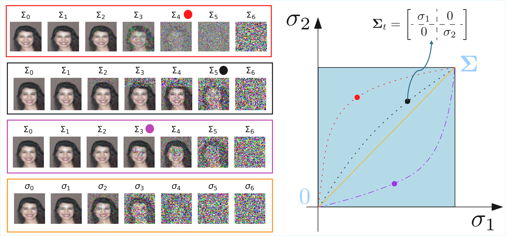
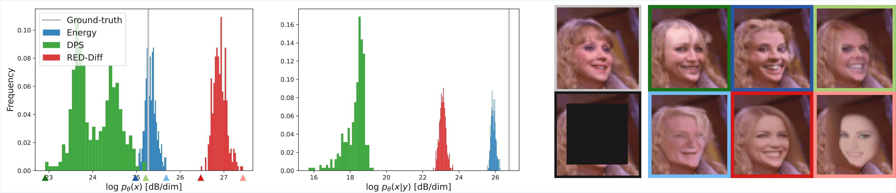

# Learning Normalized Energy Models for Linear Inverse Problems [ICML 2026]


This repository contains the official code for the paper **"Learning Normalized Energy Models for Linear Inverse Problems"** published at ICML 2026. The method learns an anisotropic energy model by training a covariance-conditioned denoiser, enabling both generative sampling and blind parameter estimation for linear inverse problems.


<div align="center">

</div>


<div align="center">

</div>


---

## Related Experiments

This repository also contains two additional sets of experiments:

| Folder | Description |
|---|---|
| [`autoregressive_exp/`](autoregressive_exp/) | Autoregressive sampling experiments (`CovarianceEDMAutoregressive`) |
| [`isotropic_exp/`](isotropic_exp/) | Guidance with isotropic score matching baseline experiments (`CovarianceEDMScoreMatching`) |

---

## Installation

The code requires **Python 3.11** and a CUDA-capable GPU. We recommend creating a new environment to avoid version conflicts.

**Option 1 — Conda (recommended):**

```bash
conda env create -f environment.yaml
conda activate stable-dif
```

**Option 2 — pip** (create an empty virtual environment first, then):

```bash
pip install -r requirements.txt
```

> **Note:** PyTorch is pinned to CUDA 12.1 builds. If your CUDA version differs, install torch manually first:
> ```bash
> pip install torch torchvision torchaudio --index-url https://download.pytorch.org/whl/cu121
> ```

The SLURM job script (`job_fg.sbatch`) activates the virtual environment at:
```
~/venvs/diffusion/bin/activate
```
Adjust this path to match your own environment.

### Repository structure

| File / Folder | Description |
|---|---|
| `main.py` | Training entry point and all training logic |
| `sampling.py` | Posterior sampling for inverse problems (batch mode) |
| `sampling_single_sample.py` | Posterior sampling for a single image |
| `samplers.py` | Sampler implementations: PC, PC-adaptive, PC-MALA, adaptive |
| `data.py` | Dataset loading and transforms |
| `noise.py` | Noise models and covariance structures |
| `networks/` | Neural network architectures (SongUNet, etc.) |
| `models/` | Saved training checkpoints |
| `samples/` | Output samples from the sampler |
| `blind_exp.ipynb` | Blind inverse problem estimation notebook (development) |
| `blind_exp_oficial.ipynb` | Blind inverse problem estimation notebook (paper figures) |
| `run.sh` | Training launch commands (SLURM) |
| `run_inverse.sh` | Inverse problem sampling launch command (SLURM) |
| `job_fg.sbatch` | SLURM batch script wrapping `python main.py` |

---

## Datasets

Before running, **edit the dataset root path in `data.py`** (and in `isotropic_exp/data.py` / `autoregressive_exp/data.py` if using those sub-experiments). Look for the line:

```python
root = "/mnt/home/.../datasets"
```

and replace it with your own dataset directory, e.g.:

```python
root = "/path/to/your/datasets"
```

The following datasets are supported:

| Dataset | `--dataset` flag | Resolution | Notes |
|---|---|---|---|
| CIFAR-10 | `CIFAR10` | 32×32 | Auto-downloaded via torchvision |
| CelebA | `Celeba` | 64×64 | Place in `~/datasets/celeba/`; custom split loader (not the official torchvision split) |
| ImageNet-64 | `ImageNet64` | 64×64 | Downsampled ImageNet; place batches in `~/datasets/imagenet64/` |
| AFHQ | `AFHQ` | 192×192 | Animal Faces HQ; place in `~/datasets/AFHQ/`; resized to 192×192 |
| MNIST | `MNIST` | 28×28 | Auto-downloaded via torchvision |

Images are expected to have pixel values in `[0, 1]` (applied automatically by the transforms). A custom folder of `.png` images can also be passed directly as the `--dataset` argument.

---

## Running the Sampler with Pre-trained Models

Pre-trained checkpoints are stored under `models/multigpu/all_together/` (feel free to modify this):

| Dataset | Checkpoint folder |
|---|---|
| CIFAR-10 | `multigpu/all_together/energy_song_dual_truncatedFreq_CIFAR10_2` |
| CelebA | `multigpu/all_together/energy_song_dual_truncatedFreq_celeba` |
| ImageNet-64 | `multigpu/all_together/energy_song_dual_truncatedFreq_imagenet` |
| AFHQ 192 | `multigpu/all_together/energy_song_dual_truncatedFreq_afhq_cat_192` |

### Running interactively (SLURM)

```bash
# Run sampling on AFHQ (inverse problem posterior sampling)
srun --pty --gres=gpu:1 -C "a100-80gb|h100" -t 7-00:00:00 --cpus-per-task=10 --mem 150G -p gpu \
bash -c "python sampling.py --dataset AFHQ; scancel \$SLURM_JOB_ID"
```

Or equivalently, directly:
```bash
python sampling.py --dataset AFHQ
python sampling.py --dataset Celeba
python sampling.py --dataset CIFAR10
python sampling.py --dataset ImageNet64
```

### Key sampling parameters (edit inside `sampling.py`)

The sampling script (`sampling.py`) hardcodes its hyperparameters directly. The main knobs are:

| Parameter | Description | Typical values |
|---|---|---|
| `sampler` | Sampler algorithm | `"PC"`, `"PC_adaptive"`, `"PC_mala"`, `"adaptive"` |
| `domain` | Degradation domain | `"pixel"` (inpainting), `"freq"` (deblurring / super-resolution) |
| `inp_mask_type` | Mask shape for inpainting | `"box"`, `"random"` |
| `box_size` | Side length of the inpainting box | 25, 30, 45, … |
| `sigma_begin` / `sigma_end` | Noise schedule endpoints | e.g., `10` / `1e-3` |
| `num_classes` | Number of diffusion timesteps | 600–1200 |
| `snr` | Step-size signal-to-noise ratio (PC corrector) | 0.13–0.20 |
| `temp` | Temperature scaling | 0.8–1.0 |
| `n_steps_each` | Corrector steps per predictor step | 1–5 |
| `blind` | Whether to estimate degradation parameters automatically | `False` / `True` |

### Output

Samples are saved to:
```
samples/<dataset>_<box_size>_<gamma_cov>_<sampler>_<domain>/
    samples_posterior_<batch_idx>.pt   # raw tensors (samples, noisy observation, clean)
    generated/                         # individual PNG images and PDF grids
    clean/                             # clean reference images
```

We provide a notebook to show how to plot these images in utils/plot_images.ipynb

### Per-dataset recommended settings (from `info.txt`)

**CelebA — box inpainting (box 45)**
```python
sigma_begin = 25; sigma_end = 1e-3; num_classes = 600
snr = 0.15; temp = 0.9; sampler = "PC"; box_size = 45
```

**CelebA — box inpainting (box 30)**
```python
sigma_begin = 8; sigma_end = 1e-2; num_classes = 200
snr = 0.15; temp = 0.8; sampler = "PC"; box_size = 30
# Reported: MSE ≈ 0.0040, LPIPS ≈ 0.032
```

**ImageNet64 — box inpainting (box 21)**
```python
sigma_begin = 8; sigma_end = 1e-2; num_classes = 500
snr = 0.2; temp = 1.0; sampler = "PC_adaptive"; box_size = 21
# Reported: MSE ≈ 0.0053, LPIPS ≈ 0.054
```

**CelebA / ImageNet64 — Gaussian deblurring (freq domain)**
```python
sigma_begin = 0.01; sigma_end = 1e-4; num_classes = 1000
snr = 0.02; temp = 1.0; sampler = "PC"; domain = "freq"
kernel_size = 8; kernel_std = 0.8
```

---

## Training

Training is launched via `main.py` (directly or through the SLURM batch script `job_fg.sbatch`).

### Example: train on AFHQ (8 GPUs, as in `run.sh`)

```bash
sbatch --gres=gpu:8 -C "a100-80gb|h100" -t 7-00:00:00 job_fg.sbatch \
    --name multigpu/all_together/energy_song_dual_truncatedFreq_afhq_cat_192 \
    --dataset AFHQ \
    --no-grayscale \
    --train-batch-size 32 \
    --test-batch-size 4 \
    --network UNet \
    --model EnergyModel \
    --reparam-kwargs "{'conversion':'inner_product'}" \
    --min-noise-level psnr=90 \
    --max-noise-level psnr=-30 \
    --noise-level-sampler UniformLog \
    --mse-var-exponent -1 \
    --train-noise-score 1 \
    --noise-score-var-exponent 1 \
    --lr 0.0002 \
    --num-training-steps 200000 \
    --lr-decay-every 100000 \
    --noise-covariance 1 \
    --size-network large \
    --no-adaptive-scale \
    --num-workers 8 \
    --num-acum-gradients 2 \
    --warmup-steps 0 \
    --use-ema \
    --ema-decay 0.9999 \
    --ema-update-every 1
```

### Key training arguments

| Argument | Description |
|---|---|
| `--name` | Experiment name; checkpoint saved to `models/<name>/` |
| `--dataset` | Dataset name (`CIFAR10`, `Celeba`, `ImageNet64`, `AFHQ`, `MNIST`, `GaussianMixture2D`) |
| `--model` | Model type: `EnergyModel` (dual score matching) or `DenoiserModel` |
| `--network` | Architecture: `UNet` uses SongUNet backbone |
| `--size-network` | `small` or `large` |
| `--reparam-kwargs` | Reparameterization; use `{'conversion':'inner_product'}` for the energy model |
| `--noise-covariance` | Set to `1` to use the full anisotropic covariance sampler |
| `--train-noise-score` | Scalar weight for the noise score loss term (dual objective) |
| `--mse-var-exponent` | Exponent for variance-weighting of the denoising MSE loss |
| `--min-noise-level` / `--max-noise-level` | Noise range in PSNR: `psnr=90` (very clean) to `psnr=-30` (very noisy) |
| `--noise-level-sampler` | `UniformLog` for log-uniform noise level sampling |
| `--lr` | Learning rate (Adam optimizer) |
| `--lr-decay-every` | Halve the LR every N optimizer steps |
| `--warmup-steps` | Linear LR warm-up steps |
| `--num-acum-gradients` | Gradient accumulation steps (effective batch = `--train-batch-size × N`) |
| `--use-ema` / `--ema-decay` | Enable exponential moving average of weights |

### Checkpoints

Training saves checkpoints to `models/<name>/model.pth.tar` (latest) and periodic copies such as `model_step<N>.pth.tar`. TensorBoard logs are written to the same directory:

```bash
tensorboard --logdir models/
```

Training automatically resumes from the last checkpoint when `main.py` is re-run with the same `--name`.

We provide the ckpts used in the paper in this link https://drive.google.com/drive/folders/1eahEVy8mXqGYqqcgeeQAIvUk7xTqt5R2?usp=sharing

---

## Blind Inverse Problem Experiments

The notebooks in the root directory implement **blind estimation** of unknown degradation parameters using the learned normalized energy.

### `blind_exp_oficial.ipynb`

Both notebooks perform the same experiment; `blind_exp_oficial.ipynb` is the cleaner version used to generate paper figures.

**What they do:**

1. **Load a pre-trained model** (default: CelebA dual energy model).
2. **Sweep candidate box sizes** (e.g., 1 to 63 pixels) and evaluate the normalized energy of a corrupted observation under each candidate covariance.
3. **Identify the energy minimum**: the box size that minimizes the energy is the model's estimate of the unknown degradation parameter.
4. **Compare dual vs. single score matching**: plot energy curves for both models and mark the ground-truth and estimated box sizes.

**Key experiment cases covered:**

| Section | Dataset | Task | Box sizes tested |
|---|---|---|---|
| Case 1 | CelebA | Blind box inpainting estimation | 5, 13, 14, 15, 19 px |
| Case 2 | CelebA | Multi-box comparison | 13, 15, 19, 29 px |
| ImageNet case | ImageNet64 | Blind estimation on natural images | 15, 20, 23, 30, 35, 40, 49 px |
| Noise level sweep | CelebA | Joint box-size + noise-level 2D estimation | grid over 25×25 noise levels |

**Running the notebooks:**


The notebook loads model `multigpu/all_together/energy_song_dual_truncatedFreq_celeba` by default. To switch to ImageNet, change the `load_args` / `load_exp` calls to `energy_song_dual_truncatedFreq_imagenet`.

**Outputs:** energy-vs-candidate-box-size plots comparing dual score matching (red) and single score matching (blue), with a green vertical line at the true box size and a red/blue dashed line at the model estimate. The dual model consistently produces a sharper minimum at the correct parameter value.


---

## Acknowledgements

This work builds on:

- [DualScoreMatching](https://github.com/FlorentinGuth/DualScoreMatching) by Florentin Guth — dual score matching framework.
- [EDM](https://github.com/NVlabs/edm) by Karras et al. (NVlabs) — elucidating the design space of diffusion models.

---


## Citation

```bibtex
@article{zilberstein2026,
  title={Learning Normalized Energy Models for Linear Inverse Problems},
  author={Zilberstein, Nicolas and Segarra, Santiago and Simoncelli, Eero P and Guth, Florentin},
  journal={Int'l Conf Machine Learning (ICML)},
  year={2026}
}
```
